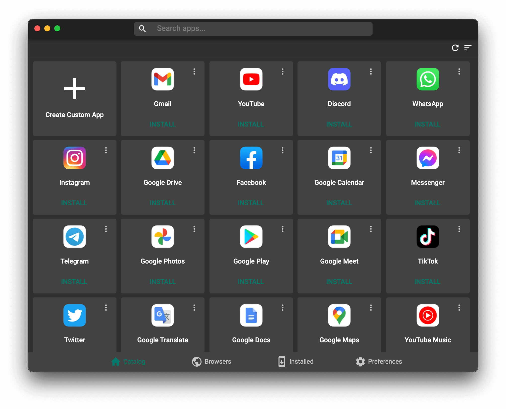
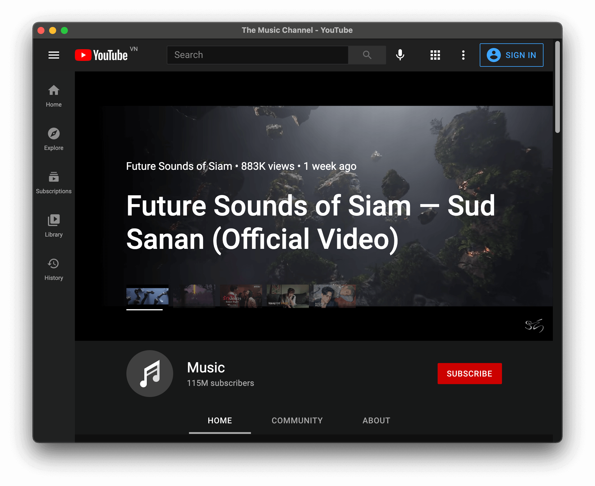
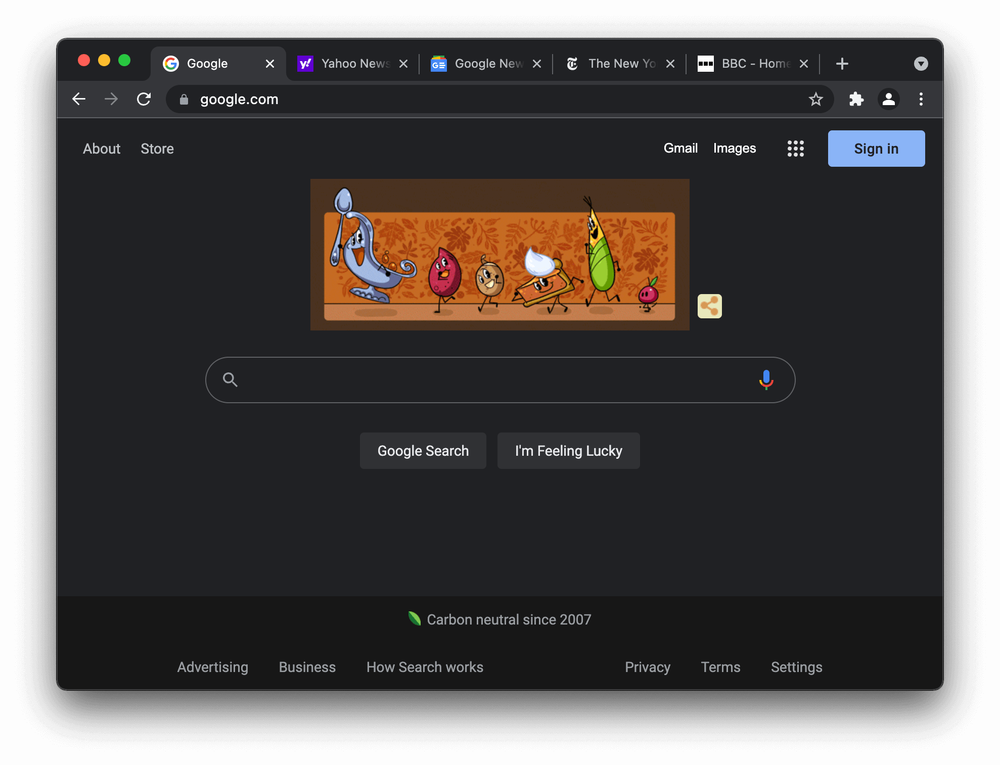

# Chromeless [](LICENSE)

|macOS|
|---|
|[](https://github.com/webcatalog/chromeless/actions?query=workflow:%22macOS%22)|

## Deprecation
**Deprecated:** Chromeless is deprecated and will no longer receive updates. Nevertheless, the app will continue working as normal. If you're looking for a better alternative, check out **[WebCatalog](https://webcatalog.io/webcatalog/)**.

**Chromeless** - Turn Any Websites into Chromium-based Apps.

## Introduction
**Chromeless** is a free Mac app which lets you create Chromium-based, Firefox-based or WebKit-based apps (also known as site-specific browsers) from any websites.

### How It Works
Chromeless is a free and open-source app for Mac that lets you create a site-specific browser (also known as Chromium-based app, chromeless app, etc) out of any website or web application, effectively turning your favorite web apps into self-contained, distraction-free desktop apps, all powered by your daily web browsers.

Supported Browser Engines:
- Google Chrome
- Microsoft Edge
- Brave
- Opera
- Vivaldi
- Chromium
- Cốc Cốc
- Yandex Browser
- Mozilla Firefox
- WebKit

### Browser Instances
Chromeless also lets you create traditional browser instances (also known as tabbed-style apps) that behave just like normal browsers but with their own cookies and storage.






---

## Source Code
On the other hand, **the source code is freely available** for use, modification and distribution under the permissions, limitations and conditions listed in the [Mozilla Public License 2.0](LICENSE).

---

## Development
This repository only contains the source code of the Chromeless app. If you'd like to contribute to the code that powers WebKit-based app, check out <https://github.com/webcatalog/webkit-wrapper>.

For the app to be fully functional, set these environment variables:
```
REACT_APP_ELASTIC_CLOUD_APP_SEARCH_SEARCH_KEY=
REACT_APP_ELASTIC_CLOUD_APP_SEARCH_API_ENDPOINT=
REACT_APP_ELASTIC_CLOUD_APP_SEARCH_ENGINE_NAME=
ELECTRON_APP_SENTRY_DSN=
```

Then, run:
```bash
# clone the project:
git clone https://github.com/webcatalog/chromeless.git
cd chromeless

# install the dependencies
yarn

# run the app
yarn electron-dev

# Build for production
yarn dist
```
